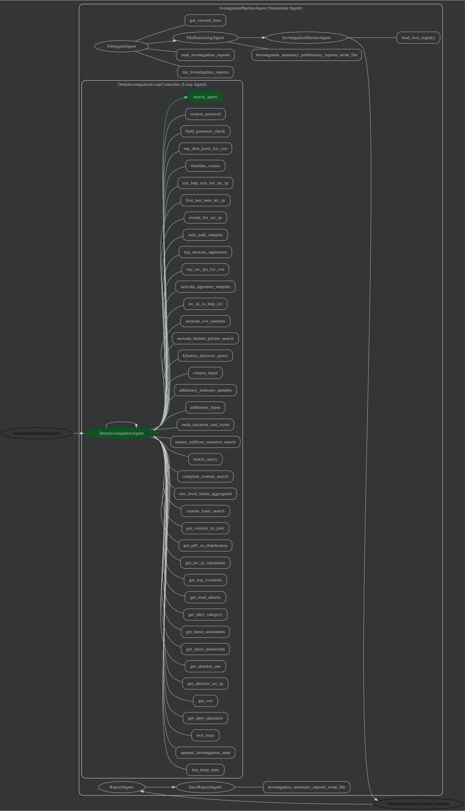

## Report Types:

### Investigation Reports
Reports on investigation conducted every 30 minutes

## Investigation Summary Reports
Manually called reports to deeper investigate the summaries

### Current Frameworks

## 30 Minute Investigator Framework

## Manual Deeper Investigation Framework

## OLD Reports:
### Daily Reports
Summary report of the past 24 hours
### Hourly Reports
Summary report of the past hour
### Investigation Reports
An investigation conducted on the past 4 hours of data
### Quarterly Reports
Summary report of the past 6 hours
### Query Reports
Output of live usuer query
### Summary Reports
Daily report of daily reports - No live quering
