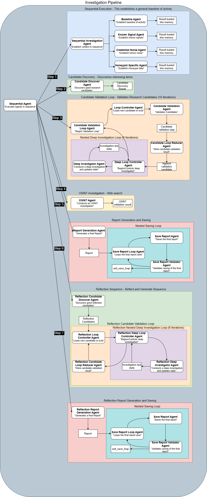
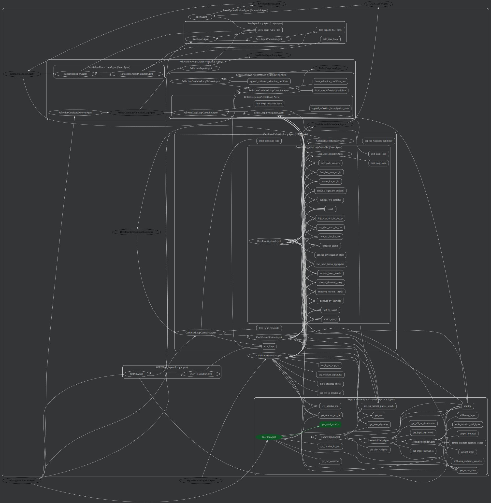
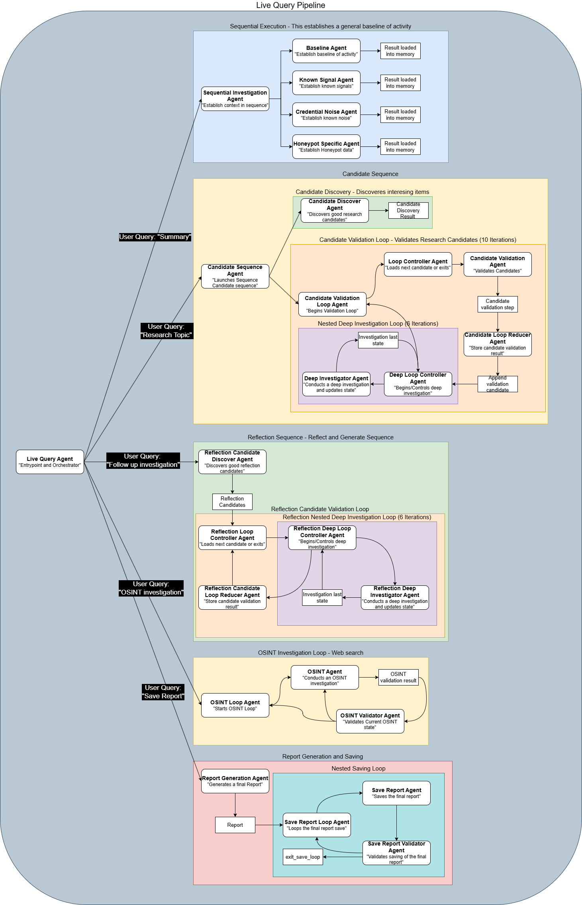
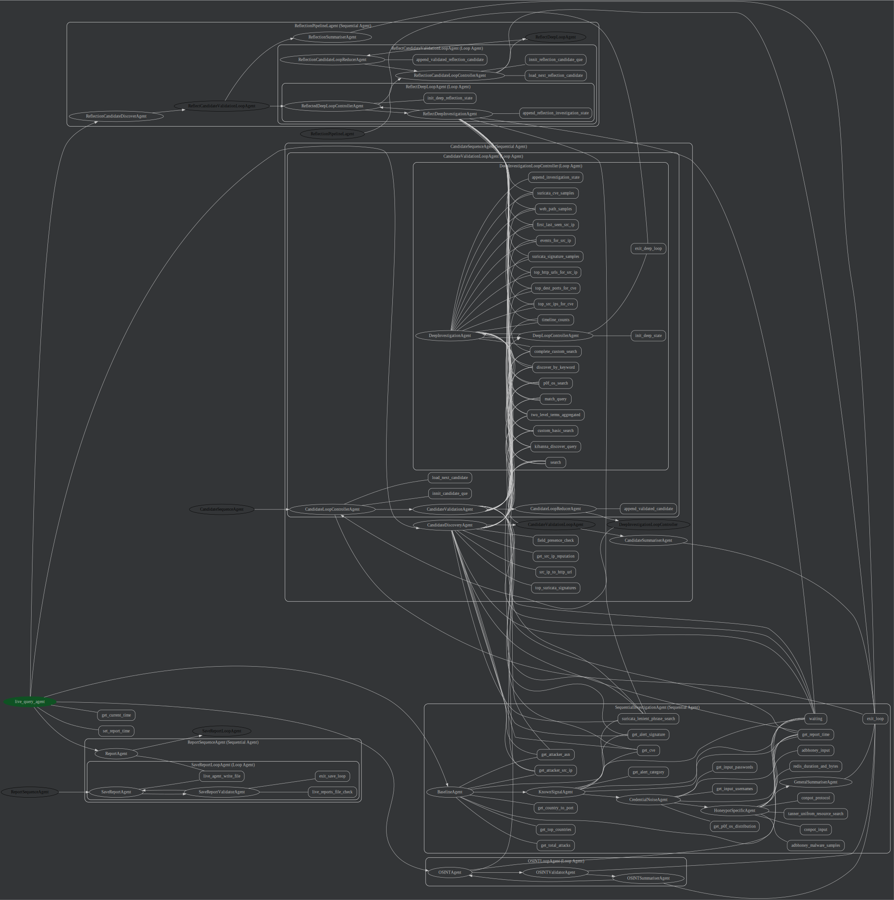
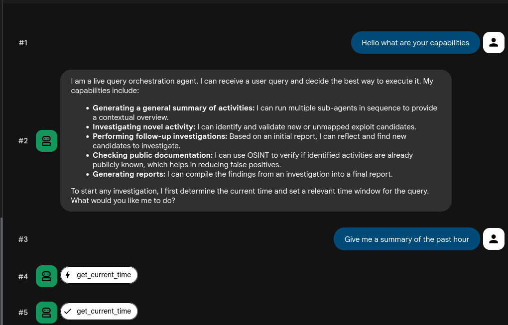
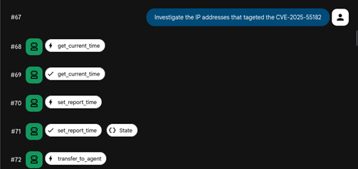
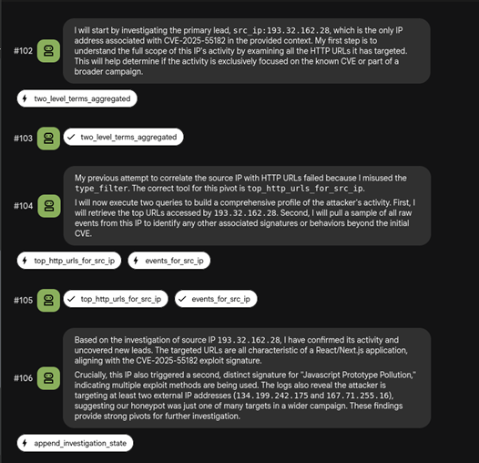
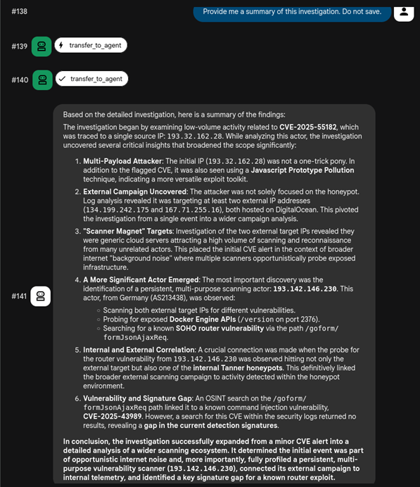

## Haineypot Summary
AI Agential framework developed to work alongisde T-Pot Honeypot by Deutsch Telekom.

Haineypot was developed using Googles Agent Development kit and uses custom workflows, agents, and tools to orchestrate and conduct automated and human-in-the-loop investigations.

The development of Haineypot and the depoyment of T-Pot started on the 19th of Feburary and is being patched still.

See below for diagrams and example output of live_querying capabilites

The development had 5 distinct phases - below are the phases and the locations of associated reports;
1. Agent Frequency and Instruction Testing [Automation] **Legacy**:
   - /old_reports/hourly_reports (1 hour summarisation reports)
   - /old_reports/quarterly_reports (6 hour summarisation reports)
   - /old_reports/daily_reports (24 hour summarisation reports)
   - /old_reports/investigation_reports (30 minute investigation reports)
   - /old_reports/investigation_summary_reports (30 minute investigation reports)
2. Loop Framework [Automation] **Legacy**
   - /old_reports/one_shot_agent_reports (automated 3-4 hour window report and investigation)
   - /old_reports/default_agent_reports (automated 3-4 hour window report and investigation)
   - /old_reports/deep_agent_old (automated 3-4 hour window report and investigation)
3. Reflect and Generate [Automation] **Current** 
   - /deep_agent_reports/ - This folder contains both pre and post reflection reports of the same time period.
4. Live Query Reports [human-in-the-loop]**In development**
   - /live_query_reports/ 

## Report Types:

### deep_agent_reports
Deep think agent with reflect and generate loop also

## Reflect and Generate Pipeline Diagram

## Reflect and Generate SVG (agents and tools listed)

## Live Query Pipeline Diagram

## Live Query SVG (agents and tools listed)

## Live Querying Example

## OLD Reports:
### Daily Reports
Summary report of the past 24 hours
### Hourly Reports
Summary report of the past hour
### Investigation Reports
An investigation conducted on the past 4 hours of data
### Quarterly Reports
Summary report of the past 6 hours
### Query Reports
Output of live usuer query
### Summary Reports
Daily report of daily reports - No live quering
### Investigation Reports
Reports on investigation conducted every 30 minutes
### Investigation Summary Reports
Manually called reports to deeper investigate the summaries
### Default reports
Single nested investigation loop
### One shot reports
Flat agent
